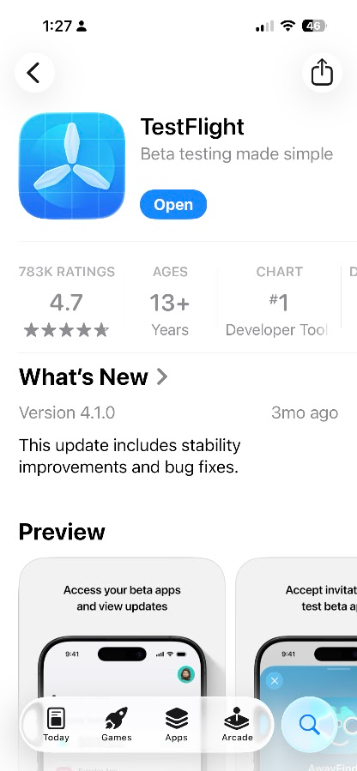
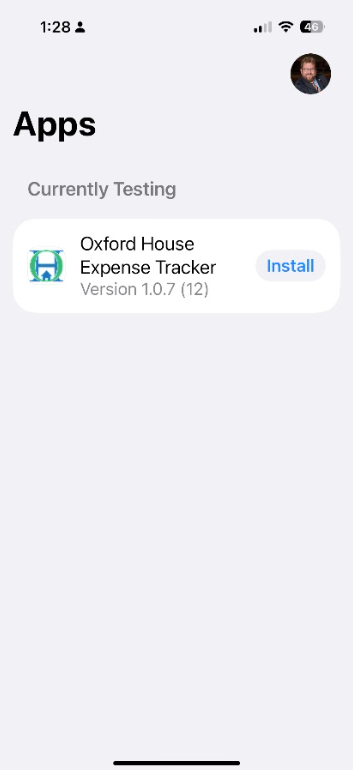
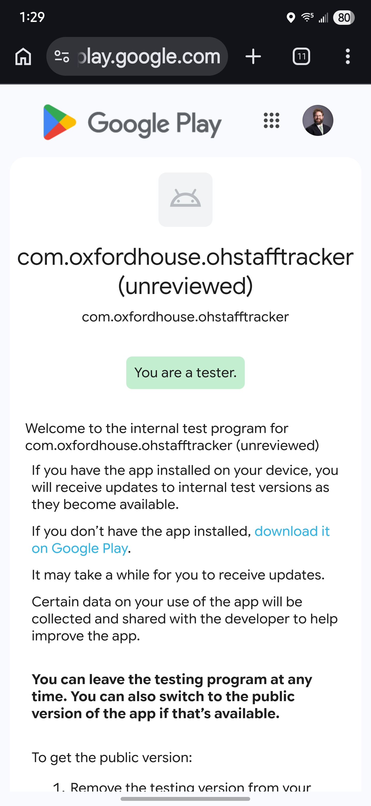
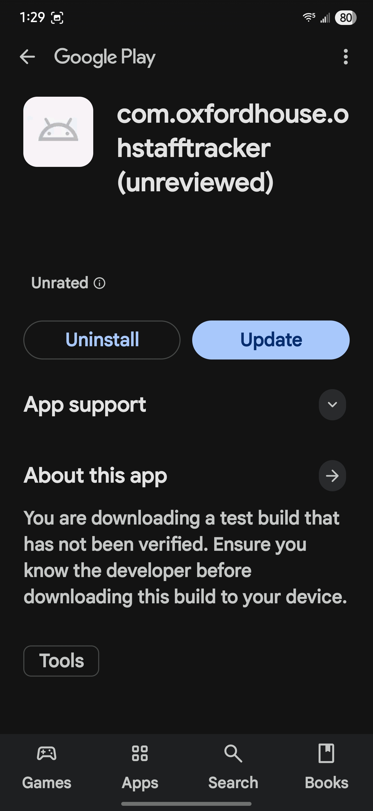

# Alpha Tester Packet — Oxford House Expense Tracker

This packet is for **alpha** testers: stress the app, exercise every feature, and report anything broken, confusing, or slow. Full PDF how-to guides for the mobile app and web portals are linked below.

---

## 1. Your mission

- Try to **stress the app** (repeat actions, edge cases, interruptions).
- **Use and test all features** (GPS, mileage, receipts, hours, per diem, web portals, etc.).
- **Report** anything that looks broken, confusing, or slow.

---

## 2. Important: Keep your normal expense process

**Do not** use this app as your only expense workflow during alpha.

You must continue to:

- Track expenses the same way you do today.
- Submit expenses to your supervisor through your **normal** process.

---

## 3. Get access (mobile and web)

### iPhone (primary tester path)

1. Install **TestFlight** from the App Store: [Download TestFlight](https://apps.apple.com/us/app/testflight/id899247664).  
   Printed URL: `https://apps.apple.com/us/app/testflight/id899247664`
2. You will be invited using your **Apple ID / iCloud** email.
3. If your iCloud or TestFlight email is **not** your work email, tell Goose so the invite goes to the right account.

### Visual reference — iPhone (TestFlight in the App Store)

<em>TestFlight in the App Store — open the listing from the link above or search for “TestFlight.”</em>

### Visual reference — iPhone (TestFlight app install / update screen)

<em>TestFlight — <strong>Oxford House Expense Tracker</strong> with <strong>Install</strong> or <strong>Update</strong>. Your screen may show a different build number.</em>

### Android

1. Join internal testing: [Join Android Internal Test](https://play.google.com/apps/internaltest/4701544356101901260).  
   Printed URL: `https://play.google.com/apps/internaltest/4701544356101901260`
2. If your Google Play account email is **not** your work email, tell Goose.

### Visual reference — Android (internal testing link)

<em>What you may see after tapping the internal test link — browser page, Play Store, or “You’re a tester” (exact layout can vary by device and Android version).</em>

### Visual reference — Android (Play Store — update available)

<em>Google Play — internal test listing when a <strong>new build</strong> is ready. Tap the blue <strong>Update</strong> button. You may see the package name and “(unreviewed)” plus a note that this is a test build — that is normal for internal testing.</em>

### Getting the latest build (updates)

When we release a new test build, use the steps below so you are not stuck on an old version.

#### iPhone — TestFlight

1. Open the **TestFlight** app (purple icon).
2. Tap **Oxford House Expense Tracker** (or your app name in the list).
3. If a new build is available, tap **Update** (or open the app from TestFlight and tap **Install** / **Update** when prompted).
4. TestFlight may also **notify** you when a new build is ready — check **Settings** in TestFlight for notification preferences.

#### Android — Google Play (internal testing)

1. Open the **Google Play Store** app.
2. Go to **Manage apps & device** → **Updates** (or open **My apps** and find the app), or search for **Oxford House Expense Tracker** and open the store listing.
3. If the internal testing track has a newer **version**, tap **Update**.
4. If you do not see an update, pull the **Updates** screen to refresh, or open the internal test link again — sometimes the Play Store needs a moment to show the new build.

### Web portals

| Portal | Access (link + printed URL) |
|--------|----------------------------|
| Staff | [Staff Portal Login](https://oxford-mileage-tracker.vercel.app/login) Printed URL: `https://oxford-mileage-tracker.vercel.app/login` |
| Supervisor | [Supervisor Portal Login](https://oxford-mileage-tracker.vercel.app/login) Printed URL: `https://oxford-mileage-tracker.vercel.app/login` |

---

## 4. Login credentials

Use the credentials **provided by Goose** (not posted in this document).

**Example format:**

| Field | Example |
|-------|---------|
| Email | `firstname.lastname@oxfordhouse.org` |
| Password | `Firstnamewelcome1` |

---

## 5. User manuals (PDF)

These match the **PDF How-To** guides in the product; use them as the reference while testing.

| Guide | Link + printed URL |
|-------|-------------------|
| Mobile App | [Mobile App How-To PDF](https://oxford-mileage-tracker.vercel.app/docs/Mobile-App-How-To.pdf) Printed URL: `https://oxford-mileage-tracker.vercel.app/docs/Mobile-App-How-To.pdf` |
| Staff Web Portal | [Staff Portal How-To PDF](https://oxford-mileage-tracker.vercel.app/docs/Staff-Portal-How-To.pdf) Printed URL: `https://oxford-mileage-tracker.vercel.app/docs/Staff-Portal-How-To.pdf` |
| Supervisor Web Portal | [Supervisor Portal How-To PDF](https://oxford-mileage-tracker.vercel.app/docs/Supervisor-Portal-How-To.pdf) Printed URL: `https://oxford-mileage-tracker.vercel.app/docs/Supervisor-Portal-How-To.pdf` |

**Support page** (all how-to guides in one place): [Oxford House Expense Tracker — Support](https://oxford-mileage-tracker.vercel.app/support.html)

Printed URL: `https://oxford-mileage-tracker.vercel.app/support.html`

---

## 6. Submit feedback and bugs

Use this form for **every** issue, improvement idea, or concern (one submission per distinct topic, or split if one report is long):

**[Submit Tester Feedback Form](https://forms.gle/vmUf6qzESDk5uTai8)**

Printed URL: `https://forms.gle/vmUf6qzESDk5uTai8`

Below is what each field is for—fill in every item that applies to your report.

### Your name

Your full name so we can follow up with questions if needed.

### Platform

Where you saw the issue or idea:

- **Mobile App** — iOS (TestFlight) or Android (internal testing).
- **Web Portal** — Staff or Supervisor (or note which portal if the form has a separate field).

If you are not sure, say what device you used (e.g. “iPhone 15, iOS 18”).

### Issue type

Pick the closest match:

| Type | Use when |
|------|----------|
| **Bug** | Something broken, wrong data, crash, or error message. |
| **Enhancement** | A concrete feature you want added or changed. |
| **User Experience Improvement** | Confusing, slow, or awkward—but not necessarily “broken.” |
| **Question / Concern** | General question or worry about rollout, privacy, or process. |

### Description (short)

One or two sentences: what happened or what you noticed. **This is the headline** someone reads first.

### Summary (more detail)

Expand here: what you were trying to do, what screen you were on, and any other context (time of day, after sync, etc.).

### Steps to reproduce

Numbered steps so another person can try the same thing:

1. …
2. …
3. …

If you cannot reproduce it, write **“Could not reproduce”** and describe what you did when it happened once.

### What you expected vs what actually happened

- **Expected:** What you thought the app or portal should do.
- **Actual:** What it did instead (including exact error text if any).

### Severity

How bad is it for real users?

| Level | Meaning |
|-------|---------|
| **Critical** | Blocks work, data loss, crash, or security concern. |
| **High** | Major feature broken or wrong data with no easy workaround. |
| **Medium** | Problematic but usable with a workaround. |
| **Low** | Minor typo, cosmetic issue, or rare edge case. |

### Frequency

How often does it happen when you try the same flow?

- **Always** — Every time.
- **Often** — More than half the time.
- **Sometimes** — Occasionally.
- **Once** — Only saw it one time.

### Attachments (screenshots or files)

Add screenshots, screen recordings, or exports when helpful. Include:

- The **full screen** or the **error message** in view.
- If the form allows, **one issue per report** so attachments stay clear.

---

**Quick reference**

| Field | Short prompt |
|-------|----------------|
| Platform | Mobile app vs web; device if helpful |
| Issue type | Bug, Enhancement, UX improvement, Question |
| Description | Short headline |
| Summary | Longer context |
| Steps to reproduce | Numbered steps or “N/A” |
| Expected vs actual | Both sides |
| Severity | Critical → Low |
| Frequency | Always → Once |
| Attachments | Screenshots / files |

---

## 7. Alpha testing focus checklist

Use this as a **coverage** list during alpha (not every item every day):

- Start and stop **GPS tracking** repeatedly.
- **Lock and unlock** the phone during active GPS sessions.
- Enter and edit **mileage**, **receipts**, **hours**, and **per diem**.
- Exercise different **navigation paths** across the app and web portals.
- Try **edge cases**: missing fields, long text, rapid taps, low signal, switching apps.

---

*Oxford House Expense Tracker — alpha testing packet.*
